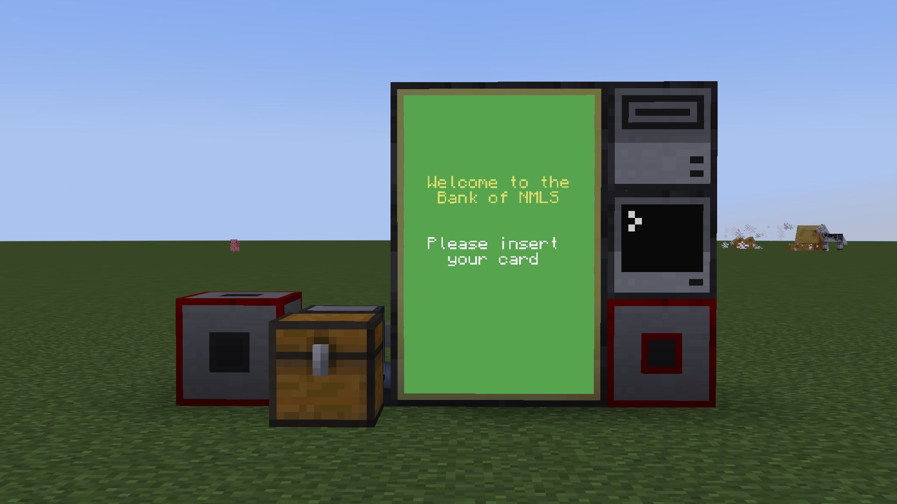
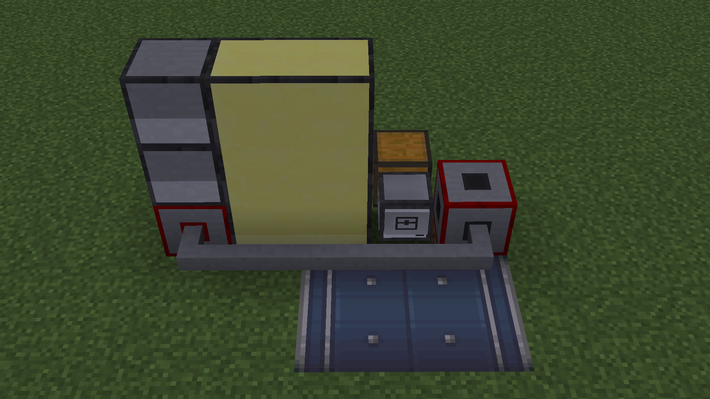

Instructions for installation of the first version of the Bank program
Install the files onto the turtle and computer and edit the required values, see comments in startup files.

Item List:
- 12 Item Vaults (Create Mod)
- 1 Chest
- 1 Disk Drive
- 1 Computer
- 1 Turtle
- 6 Advanced Monitors
- 5 Networking Cables - May vary depending on your layout
- 2 Wired Modems

Setup:

